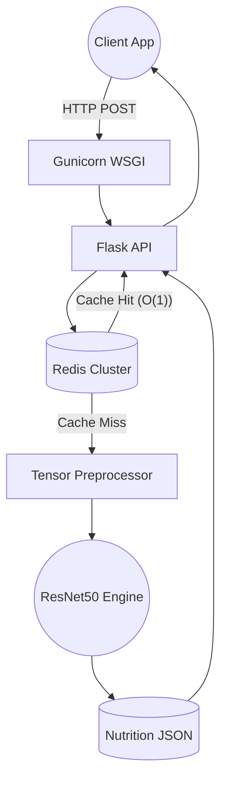

<div align="center">


# FoodVision AI
**Enterprise-Grade Deep Learning Engine for Dietary & Nutritional Analysis**

<br>

<a href="https://huggingface.co/spaces/karthik-vana1/FoodVision-AI">
  
</a>

<br><br>


</div>

<hr width="100%" size="2">

## Table of Contents

- [Project Overview](#project-overview)
- [System Architecture](#system-architecture)
- [Deep Learning Models](#deep-learning-models)
- [Dataset Specifications](#dataset-specifications)
- [Installation & Quick Start](#installation--quick-start)
- [Hugging Face Deployment](#hugging-face-deployment)
- [Author & License](#author--license)

<hr width="100%" size="2">

## Project Overview

FoodVision AI is an end-to-end computer vision pipeline designed to automate the analytical phase of dietary tracking. By applying state-of-the-art Convolutional Neural Networks (CNNs) directly to food imagery, the system reduces the time-to-insight from manual logging to milliseconds of automated inference.

**Core Capabilities:**
- **Real-Time Classification:** Identifies 34 distinct food categories with high precision.
- **Nutritional Inference:** Automatically maps predictions against a rigorous JSON datastore to return macro and micro-nutrients (Calories, Proteins, Carbs, Fats, Fiber, Vitamins).
- **Sub-10ms Caching:** Incorporates an in-memory Redis layer to hash incoming byte streams, bypassing redundant compute for identical image payloads.
- **Production-Ready UI:** Features a completely responsive, Glassmorphism-inspired interface with fluid transitions and dynamic analytics dashboards.

<br>

## System Architecture

The application adopts a decoupled, Service-Oriented Architecture (SOA). Heavy machine learning inferences are strictly isolated from the edge API layer.



**Architectural Highlights:**
- **Synchronous ML Inference Handling:** Gunicorn manages worker threads to ensure heavy TensorFlow loads do not block the main event loop.
- **In-Memory Operations:** Uploaded images are kept entirely in memory (`io.BytesIO`), completely preventing I/O disk bottlenecks and enabling seamless horizontal scaling.

<br>

## Deep Learning Models

To establish the efficacy of Transfer Learning, three independent neural network architectures were implemented, evaluated, and deployed. Users can seamlessly toggle between models at runtime.

| Architecture | Accuracy Focus | Inference Speed | Technical Summary |
| :--- | :--- | :--- | :--- |
| **Custom CNN** | Baseline (`24%`) | Ultra-Fast | Validates the complexity of the dataset. Flat dense layers easily succumb to overfitting without extensive parameters. |
| **VGG16** | Moderate (`51%`) | Standard | Transfer learning utilizing a frozen ImageNet convolutional base, applying a custom global average pooling classifier. |
| **ResNet50** | Production (`Best`) | Optimal | Employs identity shortcut connections resolving gradient degradation in deep layers. **Flagship production model.** |

<br>

## Dataset Specifications

The neural networks were trained from scratch on a specialized, heavily augmented dataset resolving real-world lighting conditions, scaling variations, and intricate plating presentations.

- **Classes:** 34 total categories.
- **Scope:** *Pizza, Burger, Sushi, Butter Naan, Chicken Curry, Masala Dosa, Chole Bhature, Cheesecake, Taco, Sushi, Chai, Jalebi*, and 22 more.
- **Input Dimension:** Strict `(224, 224, 3)` RGB Tensor matrices.
- **Augmentation Matrices:** Rotational boundary shifts, horizontal flipping, dynamic zooming, width/height axis transformations.

<br>

## Installation & Quick Start

Deploying FoodVision AI locally requires a standard machine learning environment setup.

### 1. Prerequisites
- **Python 3.10+**
- **Git** & **Git LFS** (Crucial for fetching proprietary `.h5` model files)
- **Redis Server** (Optional for memory caching)

### 2. Environment Initialization
```bash
# Clone the repository via Git LFS
git lfs install
git clone https://huggingface.co/spaces/karthik-vana1/FoodVision-AI
cd FoodVision-AI

# Track binary blobs
git lfs track "*.h5"

# Initialize the Virtual Environment
python -m venv .venv

# Windows Environment Activation
.venv\Scripts\activate

# UNIX Environment Activation
source .venv/bin/activate
```

### 3. Dependencies & Execution
```bash
# Install exact specifications
pip install -r requirements.txt

# Launch WSGI Core
python app.py
```
*The application interface will automatically mount locally at `http://localhost:5000`.*

<br>

## Hugging Face Deployment

The repository architecture is strictly formatted for zero-configuration deployment via Hugging Face Spaces using the **Docker SDK**.

- **Security Compliance:** Implements unprivileged `useradd` executions mitigating root-access vulnerabilities.
- **Git Xet Protocol:** Utilizes Hugging Face's Git Xet standard, securely orchestrating the `> 400MB` model weights transfer via LFS pointers instead of standard Git blobs.
- **Optimized Framework:** Dockerfile enforces `PYTHONUNBUFFERED=1` and strips `.pyc` caching to maximize continuous integration velocities.

<br>

## Author & License

<div align="center">


**Karthik Vana**  
*Data Engineer | AI Engineer*

<a href="https://github.com/karthik-vana"></a>
<a href="https://huggingface.co/karthik-vana1"></a>

<br><br>

> *Architecting intelligent, predictive pipelines that bridge determinism and probability.*

<br>

*Developed securely as a capstone delivery for the Viharatech EdTech engineering initiative. All rights reserved.*
</div>
